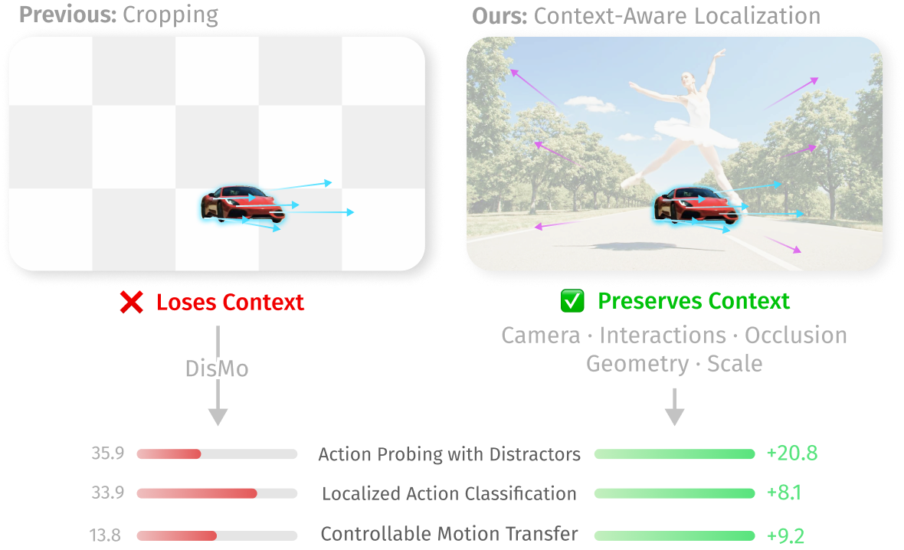
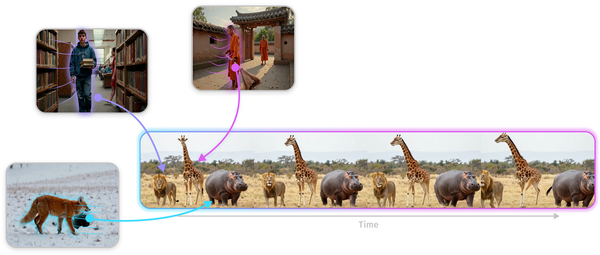

<p align="center">
  
</p>

<p align="center">
  <a href="https://compvis.github.io/WhatMoves/">
    
  </a>
  <a href="https://arxiv.org/">
    
  </a>
  <a href="https://huggingface.co/CompVis/WhatMoves">
    
  </a>
</p>

<h2 align="center">
  Localized Motion Representations for Compositional Scene Control
</h2>
<div align="center"> 
  <a href="https://ffundel.de/" target="_blank">Frank Fundel</a><sup>*</sup> · 
  <a href="https://www.linkedin.com/in/malek-ben-alaya/" target="_blank">Malek Ben Alaya</a><sup>*</sup> · 
  <a href="https://www.linkedin.com/in/thomas-ressler-494758133/" target="_blank">Thomas Ressler-Antal</a><sup>*</sup>
  <br>
  <a href="https://stefan-baumann.eu/" target="_blank">Stefan A. Baumann</a> · 
  <a href="https://ommer-lab.com/people/ommer/" target="_blank">Björn Ommer</a>
</div>
<p align="center"> 
  <b>CompVis @ LMU Munich, MCML</b>
  <br/>
  <i>* equal contribution</i>
  <br/>
  ECCV 2026
</p>


<p align="center">
  
</p>


## 💡 TL;DR

Existing motion representations often entangle the dynamics of multiple entities, while isolating objects through cropping removes important scene context. **WhatMoves learns promptable, localized motion representations directly from full videos**, capturing the motion of user-selected regions while preserving their surrounding context. These representations enable object-level motion transfer, compositional scene control, and localized action recognition.


## 🛠️ Installation

The tested configuration is Python 3.11, PyTorch 2.8, and CUDA 12.8. Create an
environment, install the PyTorch build appropriate for your CUDA installation,
and then choose the smallest dependency set you need.

```bash
git clone https://github.com/CompVis/WhatMoves.git
cd WhatMoves

python3.11 -m venv .venv
source .venv/bin/activate
python -m pip install --upgrade pip setuptools wheel packaging ninja

# Example for CUDA 12.8; use the matching official PyTorch index for your host.
pip install torch==2.8.0 torchvision==0.23.0 --index-url https://download.pytorch.org/whl/cu128
```

Install one of the following:

```bash
# WhatMoves encoder only
pip install -r requirements.txt

# Encoder + Wan motion transfer
pip install -r requirements-wan.txt --no-build-isolation

# Encoder + Wan + interactive app
SAM2_BUILD_CUDA=0 pip install -r app/requirements.txt --no-build-isolation

# Optional Wan acceleration (requires a compatible wheel or a CUDA toolkit)
pip install flash-attn==2.8.3 --no-build-isolation
```

The SAM2 CUDA extension is not needed for the app's image-prompt workflow. The
Wan path runs without FlashAttention through PyTorch SDPA. FlashAttention is
recommended for speed and memory use, but is kept optional because building it
from source requires `nvcc` and a compatible compiler toolchain.


## 🧩 Scene Composition

<p align="center">
  
</p>

WhatMoves can be used to **compose the motion of an entire scene from individual source motions**. Select an object or region in one or more source videos, choose the corresponding regions in a target image, and transfer each motion independently to its target. This makes it possible to animate different entities with motions taken from different videos while preserving the appearance and composition of the target scene.

Our released adapter integrates WhatMoves with [Wan2.2 I2V-A14B](https://huggingface.co/Wan-AI/Wan2.2-I2V-A14B). The required Wan runtime is included in `wan/`, so no separate Wan repository is needed, and the base model weights are downloaded automatically on first use.

```python
import torch

model = torch.hub.load(
    "CompVis/WhatMoves",
    "wan",
    device="cuda",
    trust_repo=True,
)

# target_image:  [B, H, W, 3], floating point in [-1, 1]
# source_video:  [B, T, Hs, Ws, 3], floating point in [-1, 1]
# source_mask:   [B, K, Hs, Ws], bool
# target_mask:   [B, K, H, W], bool

video = model.sample(
    "A concise description of the target video",
    target_image,
    source_videos=[source_video],
    source_masks=[source_mask],
    target_masks=[target_mask],
    num_frames=25,
    num_inference_steps=40,
    seed=42,
)

# video: [B, 25, H, W, 3] in [-1, 1]
```

Within each source video, the `K` selected source regions are matched positionally to the `K` regions in the corresponding target mask. To **compose a scene from multiple motions**, simply provide additional source videos and masks—their motions can then be transferred independently to different parts of the target scene.

Source masks may also be provided as temporal `[B, T, K, Hs, Ws]` mask sequences. If a static source mask was drawn on a frame other than the first one, you can provide the corresponding frame through `source_content_images` so that the content embedding is extracted from the image the mask actually refers to:

```python
# If source_mask was drawn on source frame j:
video = model.sample(
    prompt,
    target_image,
    source_videos=[source_video],
    source_masks=[source_mask],
    source_content_images=[source_video[:, j]],
    target_masks=[target_mask],
)
```

Source and output videos do not need to have the same duration: WhatMoves aligns the extracted motion representations to the requested output timeline.

Target dimensions must be divisible by 16, and the number of output frames must follow `4n + 1`, with at least nine frames for motion transfer. The released adapter was trained on **25-frame videos at 8 fps**, so we recommend staying close to this duration and frame rate for best results. The interactive app automatically resamples uploaded videos to 8 fps and previews the exact sequence used for inference.

If you already have a local copy of the Wan2.2 base model, you can load it directly:

```python
model = torch.hub.load(
    "CompVis/WhatMoves",
    "wan",
    wan_checkpoint="/path/to/Wan2.2-I2V-A14B",
    device="cuda",
    trust_repo=True,
)
```

For a visual, no-code workflow for scene composition, you can use the interactive app below.

### 💾 Resource requirements

Wan2.2 I2V-A14B requires substantial GPU memory and disk space. The base model occupies about **112 GiB** on disk, with the released WhatMoves and adapter checkpoints adding roughly **3 GiB**. We recommend keeping at least **125 GiB** available for the Hugging Face cache.

The current single-GPU implementation keeps both 14B Wan experts in GPU memory. A one-source, 25-frame generation at 480 × 704 resolution uses approximately **67.6 GiB** of peak allocated memory on an 80 GB A100. A 40 GB GPU is therefore not sufficient for the current implementation. CPU offloading, multi-GPU inference, and sequential expert offloading are not yet supported.


## 🖥️ Interactive app

Want to try WhatMoves without writing any code? The interactive app provides a simple visual workflow for **selecting motion from source videos and composing it into a target scene**.

You can upload one or more source videos, select the entities whose motion you want to reuse, choose the corresponding regions in a target image, and generate the resulting video directly from the interface. SAM2-assisted prompting makes region selection fast and interactive, while color-coded mappings help keep track of which source motion is assigned to which target object.

The app also includes a ready-to-use example and supports multiple source videos and target images, frame-accurate source masking, temporal video previews, and the available Wan guidance settings.

Launch it with:

```bash
python -m app
```

By default, the app is available at `127.0.0.1:7860`. For remote machines, Slurm setups, SSH tunneling, and additional configuration details, see [app/README.md](app/README.md).


## 🎯 Extract Localized Motion

Interested in the **motion representations themselves**? The scene composition model above uses the WhatMoves encoder internally, but you can also load and use the encoder independently—without running Wan or any generative model.

Given a video and one or more spatial masks, the encoder extracts a separate localized motion representation for each selected region while retaining the context of the full scene. Torch Hub automatically downloads the released checkpoint from [Hugging Face](https://huggingface.co/CompVis/WhatMoves), verifies its SHA-256 checksum, and caches it locally.


```python
import torch

encoder = torch.hub.load(
    "CompVis/WhatMoves",
    "what_moves",
    device="cuda",
    dtype=torch.bfloat16,
    trust_repo=True,
)

# video: [B, T, H, W, 3] floating-point RGB in [-1, 1]
# masks: [B, K, H, W] boolean regions in video's first frame
motion = encoder.encode_motion(video, masks)          # [B, T-3, K, 384]
content = encoder.encode_content(video[:, 0], masks)  # [B, K, 512]
```

The encoder accepts arbitrary spatial input sizes and internally resizes them
to 256 × 256. It operates on eight-frame windows and emits five motion tokens
per window, producing `T - 3` aligned output steps for a `T`-frame video. The
released checkpoint was trained on video sampled at **6 fps**. While the input 
frame rate can be chosen freely, we recommend using a sampling rate close to the training frame rate.

You can also omit the masks entirely to extract **global motion representations** that capture the dynamics of the full scene:


```python
global_motion = encoder.encode_motion(video)  # [B, T-3, 384]
```

### 🎞️ Temporal masks for long videos

For longer videos, you can also provide a **frame-aligned sequence of masks** with shape `[B, T, K, H, W]`. This allows WhatMoves to periodically update the content embeddings used to extract motion, instead of relying on a mask from a single reference frame throughout the entire video.

This can be useful when an entity changes substantially in appearance, pose, or structure over time, such that its representation in the first frame is no longer a good match later in the sequence.

```python
motion, content = encoder.encode_motion(
    video,
    temporal_masks,
    return_content=True,
)

# motion:  [B, T-3, K, 384]
# content: [B, T-3, K, 512], aligned with motion
```

For each extraction window, WhatMoves updates the content embedding using the first available mask at or after the start of that window. If no valid mask is available for a region within a window, the most recent content embedding is reused. Each region therefore needs at least one valid mask in the first extraction window. `frame_chunk_size` and `window_chunk_size` can additionally be used to reduce peak memory usage. Both specify per-video chunk sizes, resulting in an effective forward batch size of `B × chunk_size`.


## 🙏 Acknowledgements

WhatMoves builds on a fantastic ecosystem of open-source research. We thank the **DINOv2**, **Wan2.2**, **Hugging Face Diffusers**, and **SAM2** teams for making their work publicly available and enabling projects like this one.

This repository contains reduced and modified code from [DINOv2](https://github.com/facebookresearch/dinov2) and [Wan2.2](https://github.com/Wan-Video/Wan2.2), both released under the Apache License 2.0. The released model artifacts likewise contain a mixture of original and upstream-derived components.

For the exact licensing and attribution details, please see [THIRD_PARTY_NOTICES.md](THIRD_PARTY_NOTICES.md), [wan/LICENSE.txt](wan/LICENSE.txt), and the Hugging Face model card. The root MIT license does not replace the applicable upstream terms.


## 📝 Citation

If you find **WhatMoves** useful in your research, please consider citing our work:

```bibtex
@inproceedings{fundel2026whatmoves,
  title     = {What Moves? Localized Motion Representations for Compositional Scene Control},
  author    = {Fundel, Frank and Ben Alaya, Malek and Ressler-Antal, Thomas and Baumann, Stefan Andreas and Ommer, Bjorn},
  booktitle = {European Conference on Computer Vision (ECCV)},
  year      = {2026}
}
```

We would also love to hear about projects that build on WhatMoves or use the learned representations in new settings.

